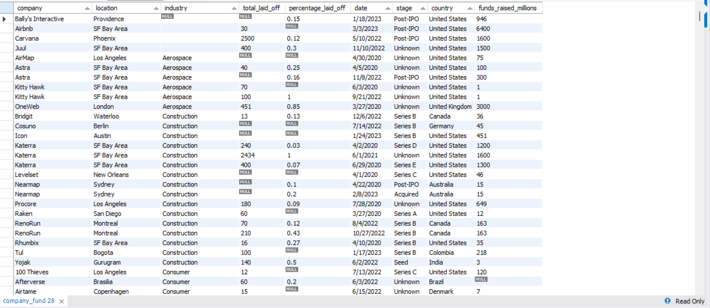
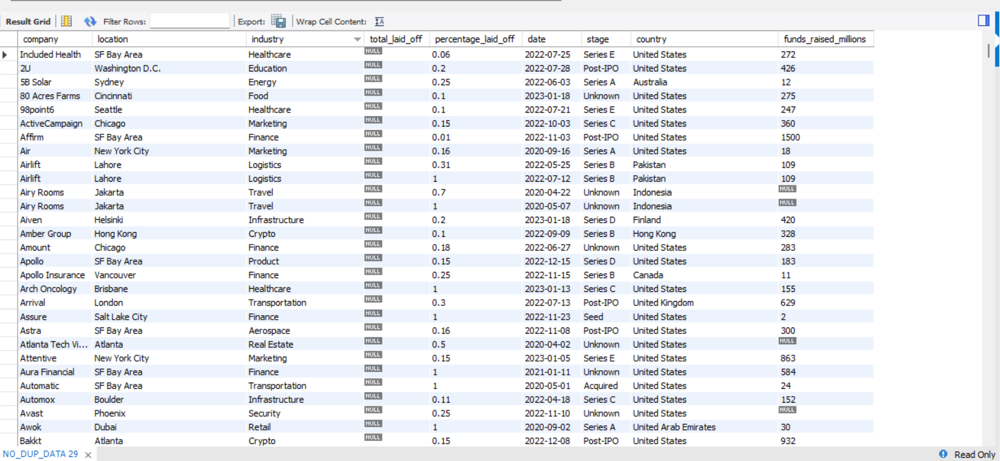

<div align="center">

# 🧹 SQL Data Cleaning Project

### End-to-End Data Cleaning using MySQL


<br>

Transforming raw company layoff data into a clean, standardized and analysis-ready dataset using SQL.

</div>

---

# 📖 Project Overview

This project demonstrates a complete SQL Data Cleaning workflow using MySQL.

The dataset contained duplicate records, inconsistent values, blank fields and incorrect date formats. The objective was to clean the dataset and prepare it for further Exploratory Data Analysis (EDA).

---

# 📂 Dataset

**Dataset Used:** `Company_Fund.csv`

---

# 🎯 Objectives

- ✅ Remove Duplicate Records
- ✅ Standardize Company & Industry Names
- ✅ Handle NULL & Blank Values
- ✅ Convert Date Format
- ✅ Remove Unnecessary Records
- ✅ Remove Helper Columns
- ✅ Prepare Clean Dataset for Analysis

---

# 🛠 Technologies Used

- MySQL Workbench
- SQL
- Window Functions
- CTEs
- Data Cleaning Techniques

---

# 📚 SQL Concepts Used

- ROW_NUMBER()
- CTE (WITH)
- TRIM()
- STR_TO_DATE()
- UPDATE
- DELETE
- ALTER TABLE
- JOIN
- Window Functions

---

# 🔄 Data Cleaning Workflow

1. Created a clone of the original table.
2. Identified duplicate records using `ROW_NUMBER()`.
3. Removed duplicate rows.
4. Standardized company, industry and country values.
5. Converted text dates into MySQL DATE format.
6. Filled missing industry values.
7. Removed unnecessary NULL records.
8. Dropped helper columns.
9. Generated the final cleaned dataset.

---

# 📸 Project Output

## 🗂 Raw Dataset



---

## ✅ Cleaned Dataset



---

# 📊 Final Result

✔ Duplicate records removed

✔ Company names standardized

✔ Industry values cleaned

✔ Country names standardized

✔ Dates converted to DATE datatype

✔ NULL & Blank values handled

✔ Analysis-ready dataset created

---

# 📁 Project Structure

```
SQL_DATA_CLEANING/
│
├── Company_Fund.csv
├── SQL_DATA_CLEANING.sql
├── raw_data.png
├── cleaned_data.png
└── README.md
```

---

# 🚀 Project Status

🟢 **Completed**

---

<div align="center">

## 👨‍💻 Author

### Shivam Upadhayay

**B.Tech AI & DS | Aspiring Data Analyst**

⭐ If you found this project helpful, don't forget to star the repository.

</div>
