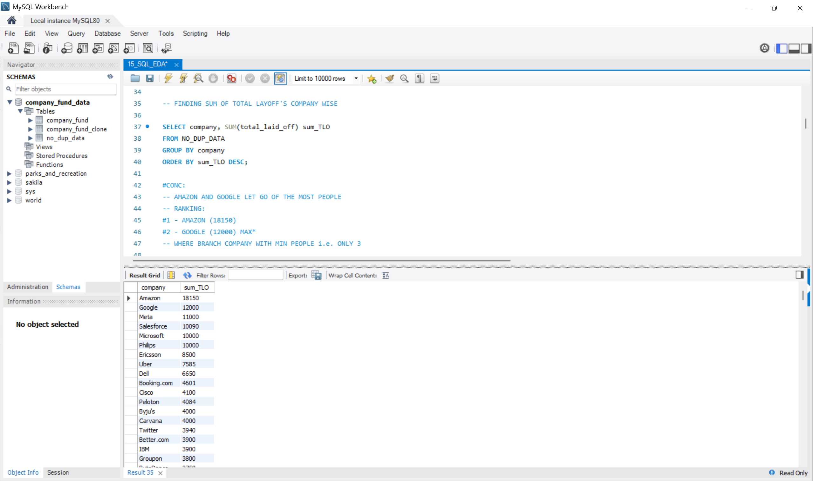
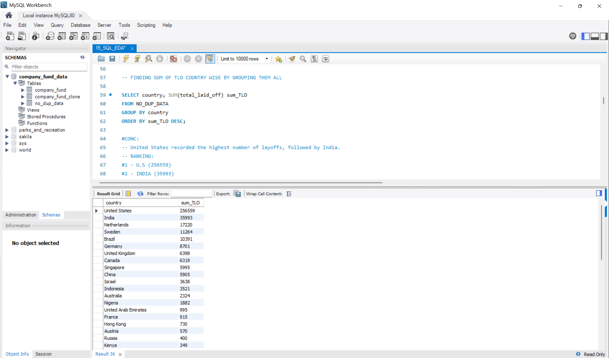
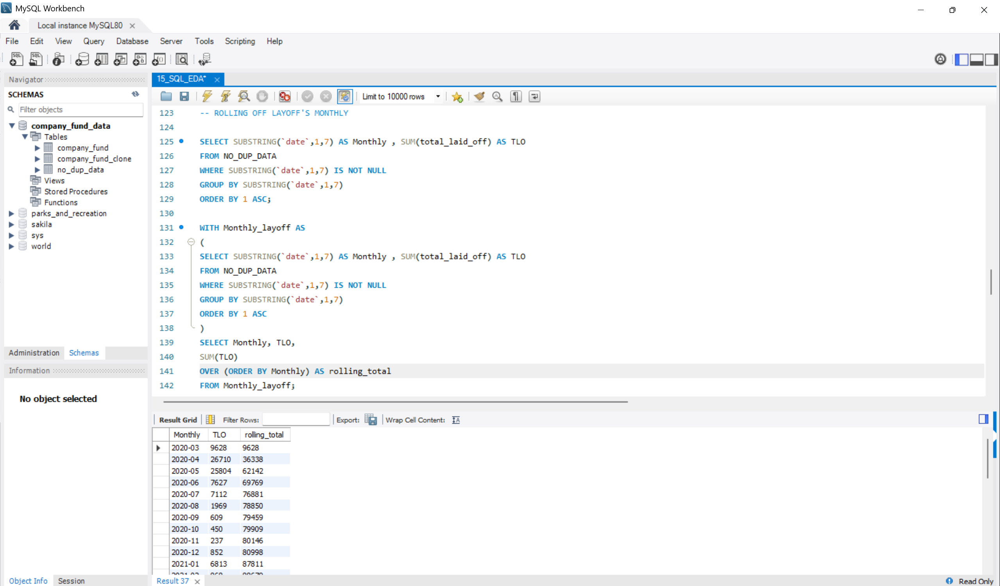
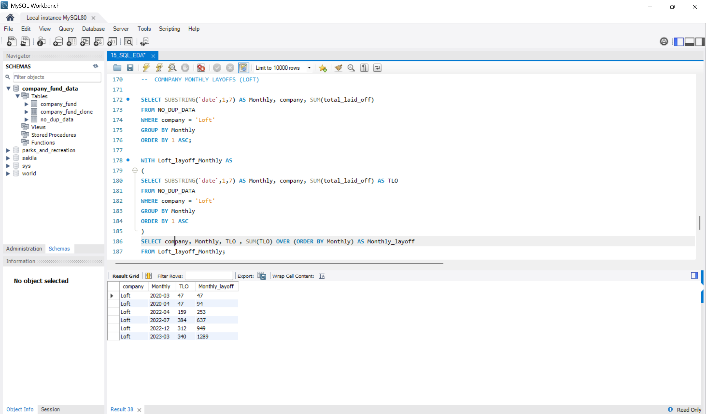
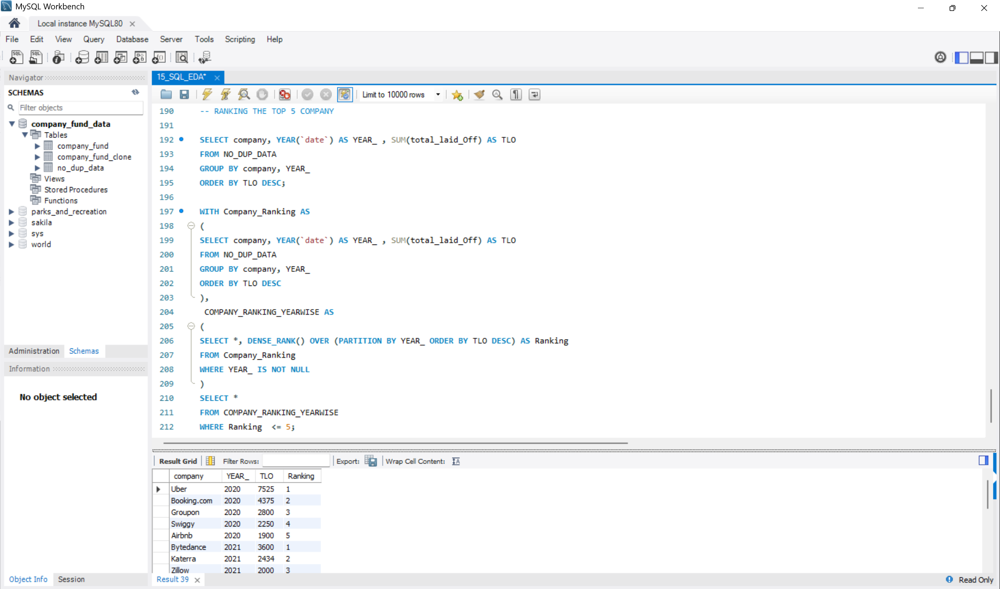

<div align="center">

# 📊 SQL Exploratory Data Analysis

### Business Insights from the Global Layoffs Dataset using MySQL


<br>

Transforming raw layoff data into meaningful business insights using SQL.

</div>

---

# 📖 Project Overview

This project performs **Exploratory Data Analysis (EDA)** on the cleaned **Global Layoffs Dataset** using **MySQL**.

The analysis focuses on discovering business insights by analyzing layoffs across companies, countries, industries, and time periods using SQL queries and advanced analytical techniques.

---

# 🎯 Objectives

- 🏢 Company-wise Layoff Analysis
- 🌍 Country-wise Layoff Analysis
- 📅 Monthly Layoff Trends
- 📈 Rolling Monthly Layoffs
- 🏆 Top 5 Companies by Year
- 💡 Generate Business Insights using SQL

---

# 🛠 Tech Stack

- MySQL
- MySQL Workbench
- SQL
- Aggregate Functions
- Window Functions
- Common Table Expressions (CTEs)

---

# 📚 SQL Concepts Used

- GROUP BY
- ORDER BY
- Aggregate Functions
- Window Functions
- CTEs
- SUM()
- AVG()
- MAX()
- MIN()
- MONTH()
- YEAR()
- DENSE_RANK()

---

# 📊 Project Outputs

## 🏢 Company-wise Layoffs

<p align="center">

</p>

---

## 🌍 Country-wise Layoffs

<p align="center">

</p>

---

## 📈 Rolling Monthly Layoffs

<p align="center">

</p>

---

## 🏢 Loft Monthly Layoffs

<p align="center">

</p>

---

## 🏆 Top 5 Companies by Year

<p align="center">

</p>

---

# 💡 Key Insights

- Amazon recorded the highest total layoffs.
- Google ranked second in total layoffs.
- United States experienced the highest layoffs globally.
- India ranked second among all countries.
- January recorded the highest monthly layoffs.
- 2022 experienced the highest layoffs across the dataset.
- Rolling monthly analysis highlights the cumulative impact of layoffs over time.
- Year-wise company rankings identify the organizations with the largest workforce reductions.

---

# 📂 Project Structure

```text
02_SQL_EXPLORATORY_DATA_ANALYSIS/
│
├── SQL_EXPLORATORY_DATA_ANALYSIS.sql
├── Company_Fund.csv
├── SUM_OF_TLO_COMPANYWISE.png
├── SUM_OF_TLO_COUNTRYWISE.png
├── ROLLING_OFF_MONTHLY.png
├── LOFT_MONTHLY_LAYOFF.png
├── TOP_5_COMPANY.png
└── README.md
```

---

# 🚀 Project Status

🟢 **Completed**

---

<div align="center">

### 👨‍💻 Shivam Upadhayay

**B.Tech Artificial Intelligence & Data Science**

**Aspiring Data Analyst**

⭐ *More real-world SQL projects coming soon.*

</div>
